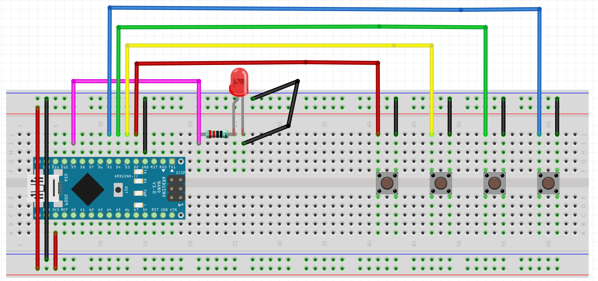
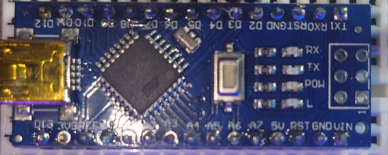
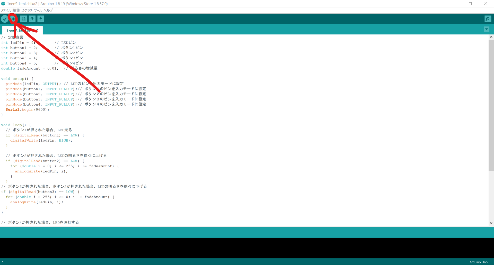

# ArduinoのLED点灯プログラム
創造技術研究会　体験入部　(制御班)
４S　野口史遠

---


# 今回は解説を聞きながらプログラムを皆さんに作ってもらいます！
### わからなくなったときは手元の資料や徘徊してる先輩に遠慮なく聞いてね。

---
## 今日の目標　
4つのボタンを使ってLEDを点灯、明るさの調整、消灯を行う
  

---
# まずは簡単なボタンを押してる間だけ光るプログラムを書いてみよう
---
定数宣言
```cpp
// LEDピンの定義
int ledPin = 9;

// ボタンピンの定義
int buttonPin = 2;
 
```

  

* `int` は、整数を宣言する
* `ledPin` はLEDが接続されているピン番号です。
* `double` は、小数が使える
---
setup()
```cpp
void setup() {
  // LEDピンを出力に設定
  pinMode(ledPin, OUTPUT);

  // ボタンピンを入力に設定
  pinMode(buttonPin, INPUT_PULLUP);
}

```
* `pinMode()` を使って、各ピンの入出力を設定します。
* `INPUT_PULLUP` を使って、ボタンが接続されたピンの内部プルアップ抵抗を有効にします。
* `OUTPUT` は出力させます。
* `ledPin` はLEDが接続されているピン番号です。

---
### if文について
C言語のif文は、指定した条件に基づいて、プログラムの実行フローを分岐するために使用されます。
条件式が真の場合、if文のブロック内の文が実行されます。条件式が偽の場合、if文のブロック内の文はスキップされ、次の行が実行されます。

---
if文は以下のような構文を持ちます。
```cpp
if (条件式) {
  // 条件が真の場合に実行される文
}
```

ここで、`条件式`は、真偽値を評価する式であり、`{}`の中には、条件が真の場合に実行される一連の文が含まれます。また、中括弧は、複数の文をブロックとしてまとめるために使用されます。
if文は、条件式が複雑な場合に、比較演算子（`<`, `>`,` ==`など）や論理演算子（`&&`, `||`, `!`など）を組み合わせることができます。

---

また、if文は、条件式が偽の場合に実行される文を指定する、else節と組み合わせることができます。else節は、次のように記述されます
```cpp
if (条件式) {
  // 条件が真の場合に実行される文
} else {
  // 条件が偽の場合に実行される文
}
```
---

loop()
```cpp
// ボタン1が押された場合、LED光る
  if (digitalRead(button1) == LOW) {
    digitalWrite(ledPin, HIGH);
  }
```
button1ピンがLOWになった場合（つまり、押された場合）、LEDが点灯するように、`digitalWrite()`関数を使用してledPinをHIGHに設定しています。
```cpp
// ボタン2が押された場合、LEDの明るさを徐々に上げる
  if (digitalRead(button2) == LOW) {
    for (double i = 0; i <= 255; i += fadeAmount) {
      analogWrite(ledPin, i);
    }
  }
```

---

### for文について

for文は、C言語において繰り返し処理を行うための構文の1つです。for文は、指定された回数または条件に従って、同じ処理を繰り返し実行することができます。

---
for文は以下のような構文を持ちます。
```cpp
for ( 初期化文 ; 条件式 ; 更新文 ) {
    繰り返し実行する処理
}
```
for文は、3つの部分で構成されています。
1. 初期化文：ループ変数の初期化を行います。この部分で変数を宣言し、初期値を代入します。
2. 条件式：繰り返し処理を行うための条件を指定します。この条件が真である限り、処理が繰り返し実行されます。
3. 更新文：ループ変数の更新を行います。この部分で変数に新しい値を代入します。

for文が実行されると、まず初期化文が実行されます。次に、条件式が評価され、その結果が真であれば、繰り返し実行する処理が実行されます。処理が実行された後、更新文が実行されます。そして再び条件式が評価され、その結果が真であれば、処理が実行されます。このサイクルが条件式が偽となるまで繰り返されます。

---
```cpp
  if (digitalRead(button2) == LOW) {
    for (double i = 0; i <= 255; i += fadeAmount) {
      analogWrite(ledPin, i);
    }
  }
```

* forループで使用する変数` i` は、0から255までfadeAmountずつ増加し、LEDの明るさを徐々に上げます
* `analogWrite()` 関数は、引数で指定したピンにPWM（パルス幅変調）信号を出力します。PWM信号は、HIGHとLOWの繰り返しで構成される信号で、HIGHとLOWの比率を変えることで平均的な電圧を制御します。ここでは、LEDの明るさを i に設定することで、PWM信号を出力してLEDの明るさを変化させています。

---
# ボタン3が押された場合、LEDの明るさを徐々に下げるプログラㇺを書いてみよう
### ヒント
最初 i = 255　で i が０より大きければ実行する 

---
答え
```cpp
// ボタン3が押された場合、LEDの明るさを徐々に下げる
if (digitalRead(button3) == LOW) {
  for (double i = 255; i >= 0; i -= fadeAmount) {
    analogWrite(ledPin, i);
  }
}
```
---
# ボタン４が押された場合、LEDをけす
### ヒント
ボタン１のときの`digitalWrite()`のなかを少し変えるだけ

---
答え
```cpp
// ボタン4が押された場合、LEDを消灯する
if (digitalRead(button4) == LOW) {
  digitalWrite(ledPin, LOW);
}
```
---
# 完成
```cpp
// 定数宣言
int ledPin = 9;        // LEDピン
int button1 = 2;       // ボタン1ピン
int button2 = 3;       // ボタン2ピン
int button3 = 4;       // ボタン3ピン
int button4 = 5;       // ボタン4ピン
double fadeAmount = 0.01;  // 明るさの増減量

void setup() {
  pinMode(ledPin, OUTPUT); // LEDのピンを出力モードに設定
  pinMode(button1, INPUT_PULLUP);// ボタン１のピンを入力モードに設定
  pinMode(button2, INPUT_PULLUP);// ボタン２のピンを入力モードに設定
  pinMode(button3, INPUT_PULLUP);// ボタン３のピンを入力モードに設定
  pinMode(button4, INPUT_PULLUP);// ボタン４のピンを入力モードに設定
  Serial.begin(9600);
}

void loop() {
// ボタン1が押された場合、LED光る
  if (digitalRead(button1) == LOW) {
    digitalWrite(ledPin, HIGH);
  }

// ボタン2が押された場合、LEDの明るさを徐々に上げる
  if (digitalRead(button2) == LOW) {
    for (double i = 0; i <= 255; i += fadeAmount) {
      analogWrite(ledPin, i);
    }
  }
// ボタン3が押された場合、ボタン2が押された場合、LEDの明るさを徐々に下げる
  if (digitalRead(button3) == LOW) {
    for (double i = 255; i >= 0; i -= fadeAmount) {
      analogWrite(ledPin, i);
  }
}

// ボタン4が押された場合、LEDを消灯する
  if (digitalRead(button4) == LOW) {
     digitalWrite(ledPin, LOW);
 }
}
```

---

## 書き込んでみよう
  

---
  

